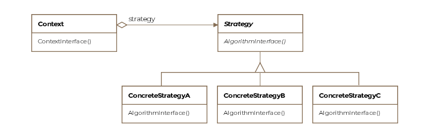
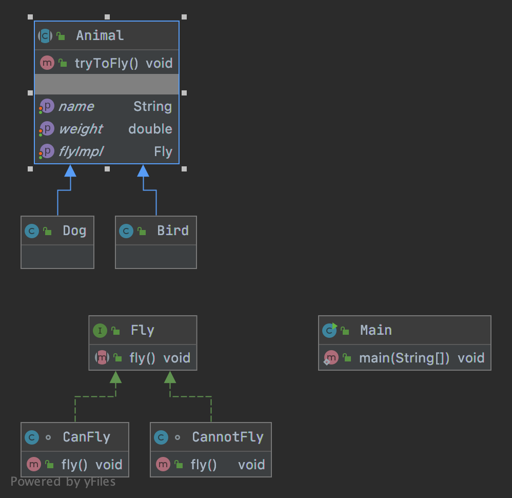
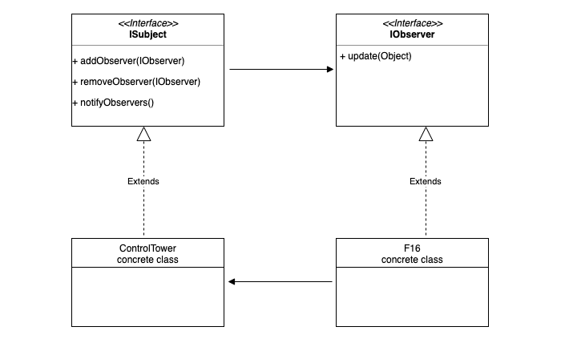
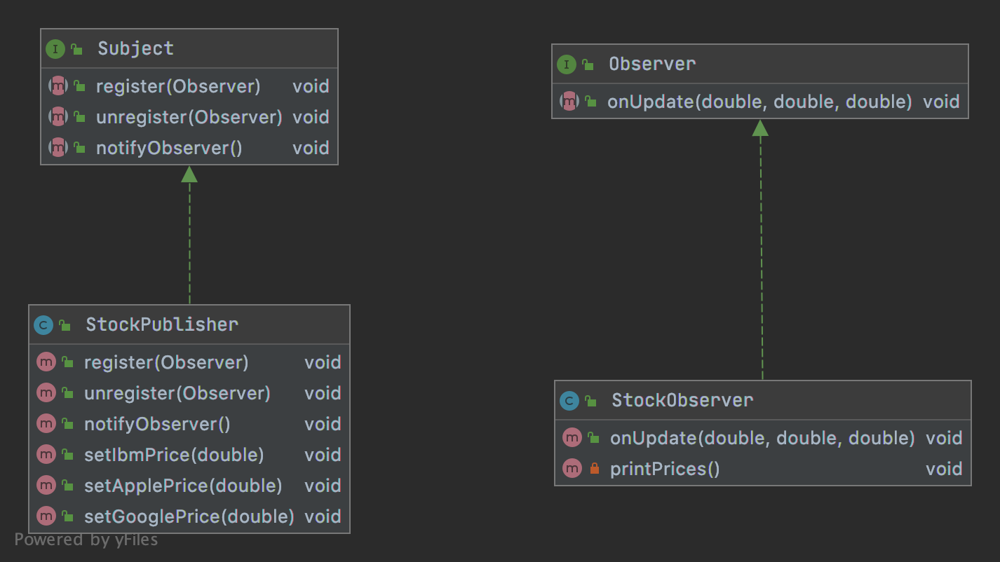
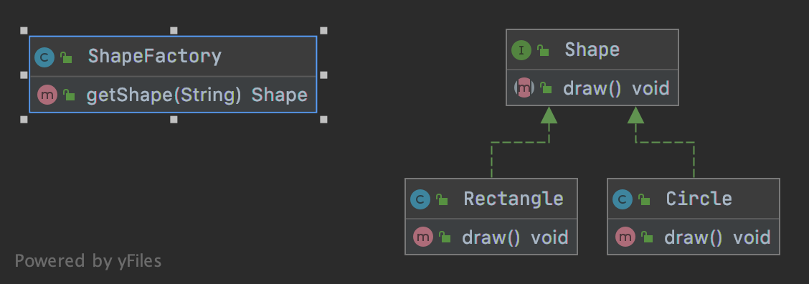
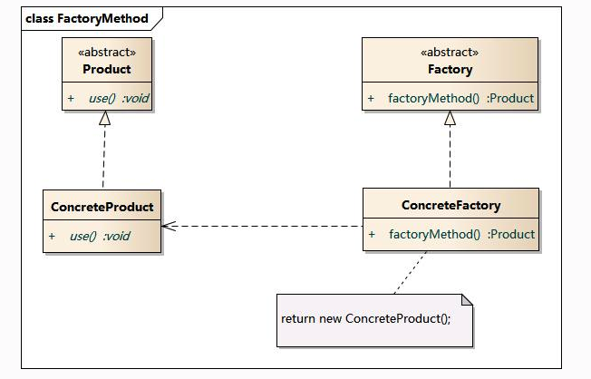
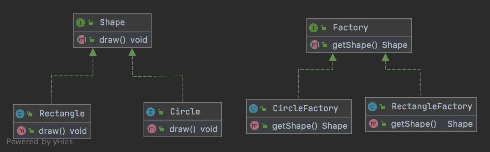

# Design Pattern Glance

---
- **Behavioral Patterns**
	- Strategy
	- Observer

- **Creational Patterns**
	- Simple Factory
	- Factory Method

---

## Behavioral Patterns

### Strategy Pattern

- The strategy pattern is formally defined as ***encapsulating algorithms belonging to the same family*** and making them interchangeable. 

- The consumers are allowed to switch out one algorithm for another seamlessly.

--

### Observer Pattern

- The strategy pattern is formally defined as ***a one to many dependency between objects, so that when one object changes state all the dependents are notified***.

- Eg. 
	- In the stock market,
		- Subject (publisher): sends many stocks to the observerss
		- Observer (subscriber): takes the ones they want and use them

- Main Points:
	- Subject maintains a list of observers and provide `register(), unregister(), notifyAll()`
	- Observer provides `onUpdate()`

- Pros & Cons:
	- Pro: loose coupling - Subject doesn't need to know anything about the Observers.
	- Cons: Subject may send updates that don't matter to the Observer. 

--

### Simple Factory Pattern

- One factory creates all products
- We create obj without exposing the creation logic to the client
- refer to newly created obj using a common interface

-	Cons
	- If a new product is added, we'll have to modify factory

### Factory Method Pattern

- Concrete factories create products
- Open-closed principal

-	Cons
	- If a new product is added, we'll have to add in its factory along with => extra overhead